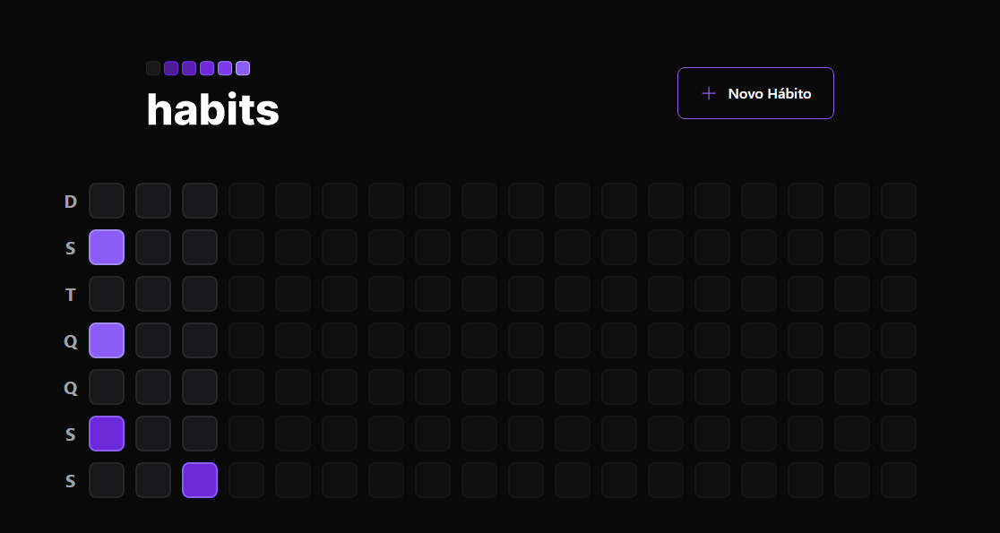
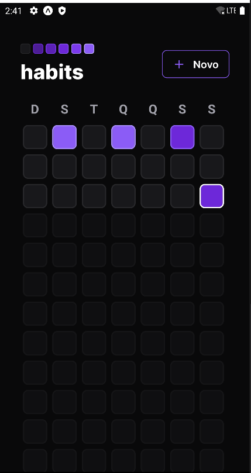
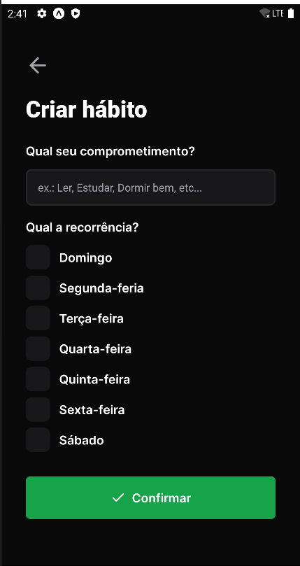

<h1 align="center">
  
</h1>

<h1 align="center"> Habits </h1>

Uma Ferramenta de Acompahar e definir hábitos e colocar em prática suas metas.

  
  
  

## 👀️ Preview - 💻 React JS

---

    

## 👀️ Preview - 📱 React Native

---

    
    

##  🛠️ Tecnologias

As seguintes ferramentas foram usadas na construção do projeto:

- [Node.js](https://nodejs.org/en/)
- [Fastify](https://www.fastify.io/)
- [Prisma](https://www.prisma.io/)
- [Vitejs](https://vitejs.dev/)
- [ReactJS](https://reactjs.org/)
- [TypeScript](https://www.typescriptlang.org/)
- [Tailwind CSS](https://tailwindcss.com/)
- [Expo](https://expo.io/)
- [React Native](https://reactnative.dev/)
- [NativeWind](https://www.nativewind.dev/)
- [Zod](https://zod.dev)
